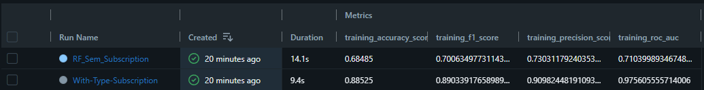
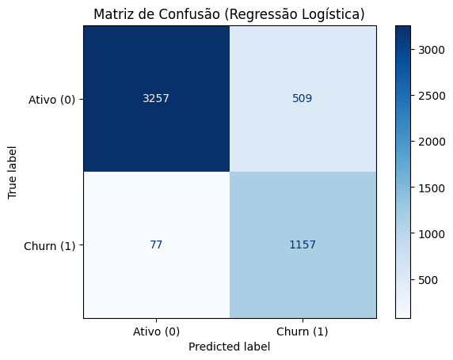
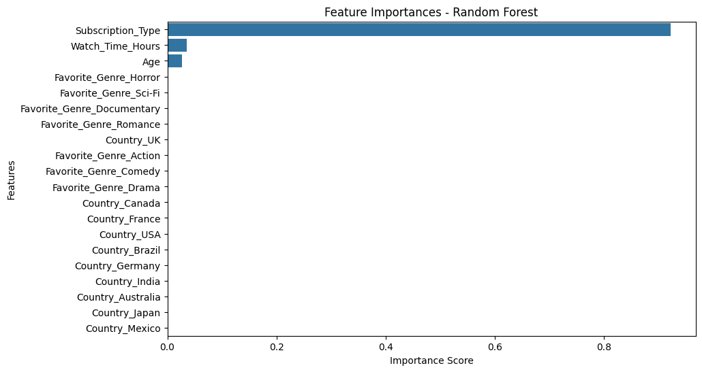
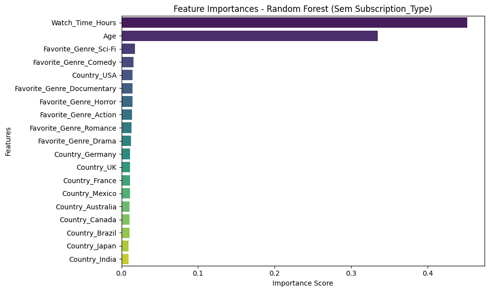

# 🎬 Netflix Churn Prediction: End-to-End Pipeline 


## 📋 Sobre o Projeto

Este projeto consiste em uma solução completa de Machine Learning para prever o **Churn (cancelamento)** de usuários de um serviço de streaming (dados similares à Netflix).

O objetivo principal não foi apenas criar um modelo preditivo, mas construir um pipeline robusto seguindo boas práticas de **MLOps**, garantindo rastreabilidade dos experimentos e facilidade de deploy.

## 🚀 Destaques e Tecnologias

* **Análise Exploratória (EDA):** Identificação de padrões de comportamento e definição da variável target (Churn) baseada na inatividade do usuário.
* **Modelagem Preditiva:** Teste e seleção de algoritmos (ex: Random Forest, XGBoost) para maximizar a métrica de [F1 Score e ROC].
* **MLflow Tracking:** Utilizado para registrar parâmetros, métricas e versionar os modelos gerados durante os experimentos.
* **Docker:** O modelo final foi encapsulado em um container Docker, garantindo que a aplicação de inferência rode de forma isolada e reproduzível em qualquer ambiente.

## 🛠️ Arquitetura do Projeto

1.  **Ingestão & Processamento:** Limpeza de dados e Feature Engineering.
2.  **Treinamento:** Pipeline de treino com validação cruzada.
3.  **Tracking:** Logs automáticos via MLflow.
4.  **Deploy:** API servida via [Flask/FastAPI/Streamlit] dentro de um container Docker.

## 📦 Como Rodar

### Pré-requisitos
* Docker instalado
* Python 3.8+

### Passo a passo

1. Clone o repositório:
```bash
git clone [https://github.com/seu-usuario/netflix-churn-project.git](https://github.com/seu-usuario/netflix-churn-project.git)
cd netflix-churn-project
```

2. Construa a imagem Docker:

```
docker build -t netflix-churn-model .
```
3. Execute o container: 

```
docker run -p 5000:5000 netflix-churn-model
```


## 📊 Resultados

### 🧠 Metodologia e Descobertas

1. O Problema do Data Leakage (Vazamento de Dados)

- Durante o desenvolvimento, utilizando regressão logística, identificou-se que a variável Subscription_Type apresentava um poder preditivo artificialmente alto (ROC AUC 0.97). 

  - Decisão: Optei por remover esta variável para evitar que o modelo apenas "decorasse" o plano do usuário.

  - Justificativa: Um modelo de Churn útil deve identificar comportamentos (horas assistidas, idade, engajamento) que antecedem a decisão de saída, e não apenas classificar o status atual do contrato.

2. Performance do Modelo Final (Random Forest)

- ROC AUC: 0.71

Conclusão: A superioridade do Random Forest (AUC 0.71) sobre o XGBoost (AUC 0.51) sugere que o dataset possui uma relação sinal-ruído desafiadora, onde a técnica de Bagging do RF ofereceu uma generalização mais robusta contra o overfitting do que a abordagem de Boosting. Além disso, o tempo de tela e a idade são sim informações determinantes.

#### Evidências








